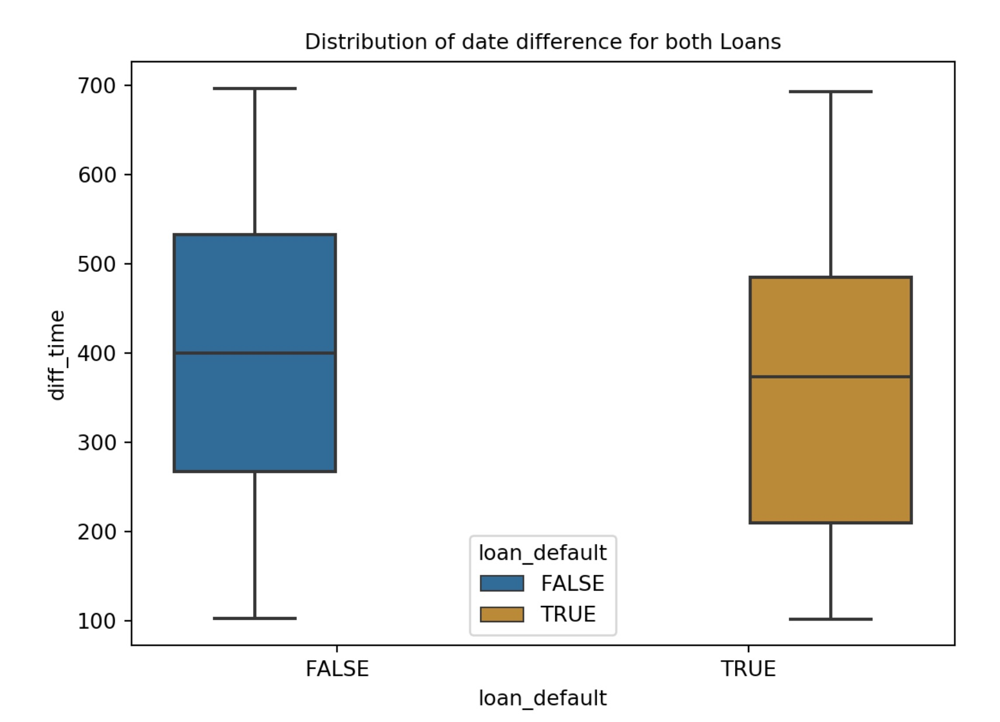

The objective of this assignment is to answer few questions based on datasets by creating analysis and visualizations. The dataset we use are transaction dataset which contains all of the bank's transactions, and accounts_analytical dataset containing the information for every account. 

The questions and corresponding visualizations are shown:

**1. Explore all accounts. Create visualizations that combine or these account characteristic:**

- Whether an account has a credit card or not
- Whether an account has a loan or not
- The average balance for the account

```{r,echo = FALSE,results='hide',message=FALSE,fig.align='center'}
library(dplyr)
library(ggplot2)
library(ggpubr)

trans <- read.csv('/Users/huxin/Desktop/ANLY 503/A5 - Basic Graphs/data/transactions.csv')
acct <- read.csv('/Users/huxin/Desktop/ANLY 503/A5 - Basic Graphs/data/accounts_analytical.csv', na.strings=c("","NA"))

trans_in <- trans %>% 
  group_by(account_id) %>%
  summarize(avg_balance = as.integer(mean(balance)))

trans_plt <- trans_in %>% ggplot(aes(avg_balance)) +
     geom_histogram(binwidth = 20) +
     theme_bw() +
     theme(plot.title = element_text(hjust = 0.5)) +
     ggtitle ('The Distribution of Average balance') 

credit <- acct %>%
  group_by(credit_cards) %>%
  summarise(count = n())

credit[is.na(credit)] <- 0
credit$credit_cards <- as.character(credit$credit_cards)

credit_plt <- credit %>% ggplot(aes(credit_cards, count, fill = credit_cards )) +
     theme_bw() +
     theme(plot.title = element_text(hjust = 0.5)) +
     geom_bar(stat='identity') +
     scale_fill_manual(values=c("#999999", "#E69F00", "#56B4E9")) +
     ggtitle ('Number of credit cards') 
acct$loan_date[is.na(acct$loan_date)] <- 0
acct$loan <- ifelse(acct$loan_date == 0, 'No', 'Yes')

loan <- acct %>%
  group_by(loan) %>%
  summarise(count = n())

loan_plt<- loan %>% ggplot(aes(loan, count, fill = loan)) +
     theme_bw() +
     theme(plot.title = element_text(hjust = 0.5)) +
     geom_bar(stat='identity') +
     scale_fill_brewer(palette="Blues") +
     ggtitle ('The distribution of Loan') 

figure <- ggarrange(trans_plt, ggarrange(
  loan_plt, credit_plt, ncol = 2), nrow = 2)
figure
```
$~$
$~$

From the graph above, we could find that most of accounts don't have credit cards, and most of them don't have loan neither. The distribution of average balance shows that the average balance for all accounts are between 20000 and 60000.

$~$
$~$
$~$
$~$


**2. What is the distribution of all loans and what are their characteristics?**

$~$
$~$

```{r,echo = FALSE,results='hide', warning=FALSE,message=FALSE,fig.align='center'}
loan_amount <- acct %>% ggplot(aes(y=loan_amount)) +
     geom_boxplot() +
     theme_bw() +
     theme(plot.title = element_text(hjust = 0.5)) +
     ggtitle ('The Distribution of Loan amount') 

loan_term <- acct %>% 
  group_by(loan_term) %>%
  summarize(count = n()) 

loan_term <- na.omit(loan_term) 
loan_term$loan_term <- as.character(loan_term$loan_term)

loanterm_plt <- loan_term %>% 
     ggplot(aes(loan_term, count, fill = loan_term)) +
     theme_bw() +
     theme(plot.title = element_text(hjust = 0.5)) +
     geom_bar(stat='identity') +
     scale_fill_brewer(palette="Greens") +
     ggtitle ('Distribution of loan term') 

loan_status <- acct %>% 
  group_by(loan_status) %>%
  summarize(count = n()) 

loan_status <- as.data.frame(loan_status)
loan_status[3,1] <- "No Loan"


mycols <- c("#0073C2FF", "#EFC000FF", "#868686FF", "#CD534CFF")

loanstatus_plt <- ggplot(loan_status, aes(x = "", y = count, fill = loan_status)) +
  geom_bar(width = 1, stat = "identity", color = "white") +
  coord_polar("y", start = 0)+
  geom_text(aes(label = count),color = 'white', position = position_stack(vjust = 0.5)) +
  scale_fill_manual(values = mycols) +
  theme_void() +
  theme(plot.title = element_text(hjust = 0.5)) +
  ggtitle('Distribution of loan status') 

loan_default <- acct %>% 
  group_by(loan_default) %>%
  summarize(count = n()) 

loan_default <- as.data.frame(loan_default)
loan_default[3,1] <- "NA"

loandefault_plt <- loan_default %>% 
     ggplot(aes(loan_default, count, fill = loan_default)) +
     theme_bw() +
     theme(plot.title = element_text(hjust = 0.5)) +
     geom_bar(stat='identity') +
     scale_fill_manual(values = c("#56B4E9", "#009E73", "#F0E442")) +
     ggtitle ('Loan Default') 

figure <- ggarrange(loan_amount,loanterm_plt,loanstatus_plt,loandefault_plt, ncol = 2, nrow = 2)
figure
```

$~$

First, the median value of loan amount is around 100,000, and the maximum loan amount is about 600,000. As for the characteristics of loans, we could see that the distribution of loan term is basically even. For loan status, current loans are more than expired loans. From the Loan Default bar plot, the number of loan not in default is greater than the number of loan in default.

$~$
$~$
$~$
$~$


**3. Is there a relationship between a good or bad loan and the time between an account is opened and the loan is created? Is there a specific set of accounts that seem to be at higher or lower risk of defaulting?**

$~$
$~$



$~$

The distribution of time difference between an account is opened and the loan is created for both loan default and the loan not default does not have much difference. Good loan seems to have higher duration of time difference compared to bad loan.

$~$
$~$
$~$
$~$

**4.For the account with the highest number of transactions, make a time series line plot for the behavior of the account over time, including all debits and credits, the different methods, and the with the different categories.**

$~$
$~$

```{r,echo = FALSE,results='hide', warning=FALSE,message=FALSE,fig.align='center'}
high_acct <- trans %>%
  group_by(account_id) %>%
  summarise(number = n())

account_2 <- trans %>%
  filter(account_id == 2)

account_2$date <- as.Date(account_2$date)

amount <- ggplot(account_2, aes(x = date, y = amount)) +
  geom_line(color = "#00AFBB") + 
  xlab("") +
  theme_bw() +
  theme(plot.title = element_text(hjust = 0.5)) +
  ggtitle ('Time Series for change in amount') 
 
balance <- ggplot(account_2, aes(x = date, y = balance)) +
  geom_line(color = "#E7B800") + 
  xlab("") +
  theme_bw() +
  theme(plot.title = element_text(hjust = 0.5)) +
  ggtitle ('Time Series for change in balance') 
 
figure <- ggarrange(amount,balance, nrow = 2)
figure
```

$~$

We could see the change in amount is pretty consatant except for a peak around 4000 between 1996 and 1998.

$~$
$~$
$~$
$~$

**5. Explore the validity of the data for the case whether or not an account has a credit card and whether or not they have associated credit card transactions. Is there anything worth noting?**

$~$
$~$

```{r,echo = FALSE,results='hide', warning=FALSE,message=FALSE,fig.align='center'}
acct_credit <- acct %>% 
  filter(credit_cards >= 1) %>%
  select(account_id)


relation <- trans %>%
  filter(account_id %in% acct_credit$account_id) %>%
  filter(method == 'credit card') %>%
  group_by(account_id) %>%
  summarise(number = n())

relation$account_id <- as.character(relation$account_id)

status <- c('Have credit transactions' , 'Not have credit transactions')
value <- c(139, 725)
compare <- data.frame(status, value)

plt <- ggplot(compare, aes(x = status, y = value, fill = status)) + 
  theme_bw() +
  theme(plot.title = element_text(hjust = 0.5)) +
  geom_bar(stat = "identity") +
  ggtitle('The transaction of account with credit cards') 

plt 


```

$~$

From the bar plot, a large amount of account does not have credit transactions.

